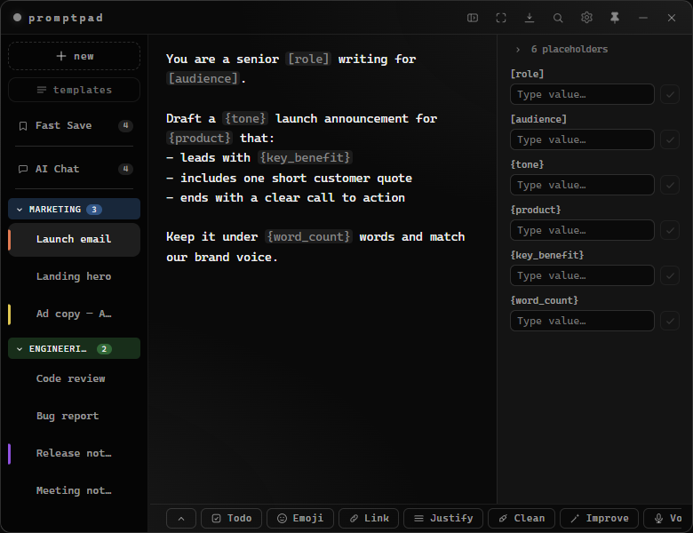
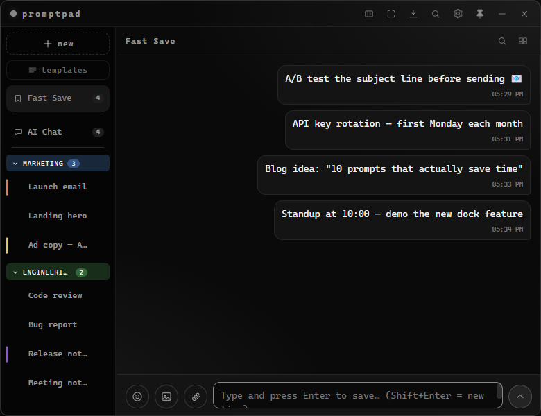
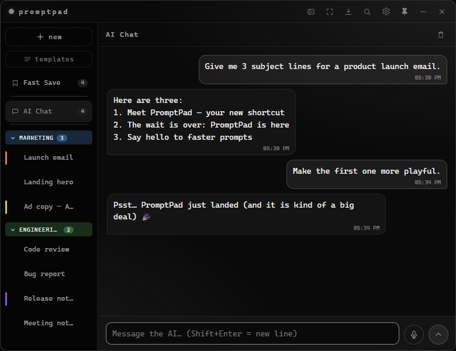
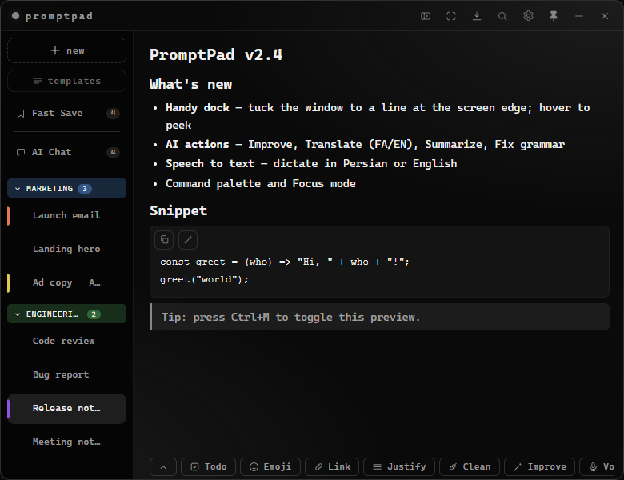
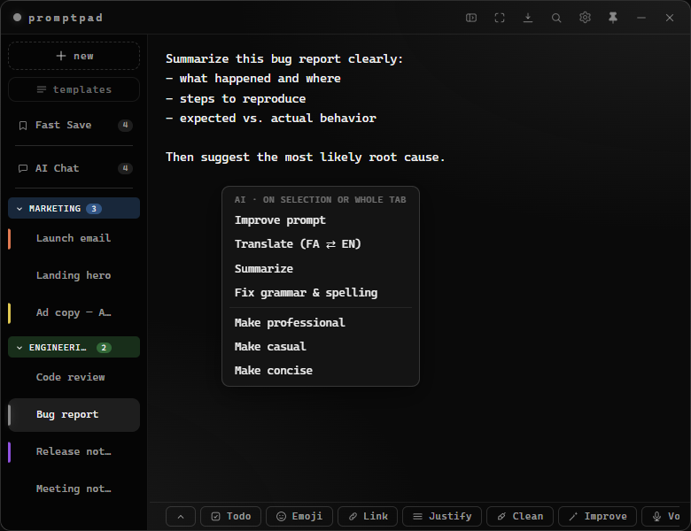
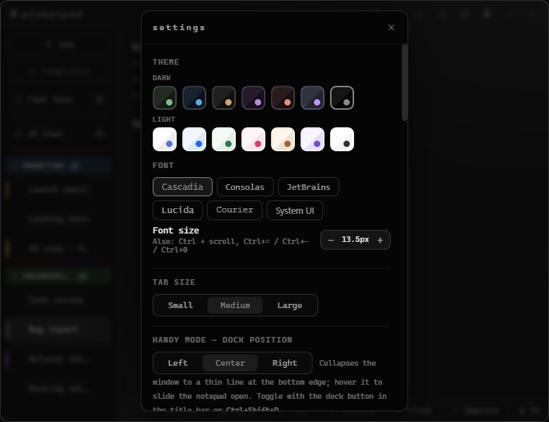

# PromptPad

A compact, always-on-top desktop notepad for writing and organizing AI prompts. Built with Electron.

Minimal, fast, and right next to your work — with tabs, 14 themes, live placeholder fill, templates, find & replace, a Telegram-style Fast Save, a free built-in AI chat, one-click AI actions, speech-to-text, a handy edge-dock, inline images, todo checklists, and a global quick-capture hotkey.

## 📸 Screenshots

Shown in the **Mono** theme — 14 themes total (7 dark + 7 light) are available in Settings.

| Workspace — tabs, colored groups, placeholders & live fill | Fast Save — Telegram-style pinned quick notes |
|:---:|:---:|
|  |  |

| AI Chat — free built-in chat, no API key | Markdown preview — code blocks with Copy / Improve actions |
|:---:|:---:|
|  |  |

| AI actions — Improve, Translate, Summarize, Fix grammar, change tone | Settings — theme picker, tab size, handy dock & more |
|:---:|:---:|
|  |  |

## ✨ Features

- **Compact always-on-top widget** — frameless window that floats above other apps, with a pin toggle
- **Tabs** — a left sidebar rail (hide it any time with the title-bar arrow or `Ctrl+\`), with adjustable tab size (Small / Medium / Large)
  - Add with `+`, click to switch, drag & drop to reorder
  - **Pin** tabs so they stay on top of the list
  - Auto-named from first line; `Shift+click` or double-click to rename
  - **Multi-select** — `Ctrl+click` to pick several tabs, `Ctrl+Shift+click` for a range, then right-click for bulk actions: rename as `1/name, 2/name…`, set a color, move to a group, or close them all
  - **Colors** tint the tab's left edge; group headers can be colored as a whole (right-click a group → Rename, Duplicate, Copy/Export content, Color, Pin, Ungroup)
  - **Per-tab files** — attach files to a tab with the "Attach File" button; open, save a copy, reveal, or remove them from the files panel
  - **Right-click context menu** — Rename, Duplicate, Copy content, Export as file, Save as template, color (8 colors), Pin/Unpin, Close
- **14 themes** — 7 dark (Forest, Midnight, Carbon, Plum, Ember, Dracula, Mono) + 7 light (Paper, Sky, Sage, Rose, Latte, Lavender, Snow), grouped in Settings
- **Placeholder quick-fill** — write `[bracket]` or `{brace}` blanks; they highlight automatically and a fill bar lets you type values one by one
  - **Live preview** — typed value appears inside the prompt in real-time before you confirm
  - Enter jumps to the next field
  - Bar can sit above the prompt or as a resizable side panel; one scrollable line or stacked rows
- **Fast Save** — a chat-style "saved messages" note pinned above your tabs (like Telegram), renameable by `Shift+click`ing its label. Type and press Enter to save; each message keeps a timestamp with copy / **edit** / delete buttons and per-message RTL. Attach images or **files** (paste or button) with an optional caption, `Ctrl+click` to multi-select and delete messages, search your messages, and browse images in a **media gallery** (right-click an image → **Go to message**). Toggle it off in Settings.
- **AI Chat** — a free, no-signup chat pinned in the sidebar next to Fast Save, for quick questions without leaving the app. One continuous conversation, cleared with a click; auto-trims after 200 messages so it never bloats.
- **Improve Prompt & AI actions** — rewrites your draft into a clearer, more effective prompt with one click (or right-click → Improve, or on just a selected line). Right-click the Improve button — or the editor's **AI actions ▸** menu — for more: **Translate** (Persian ⇄ English), **Summarize**, **Fix grammar**, and tone presets (Professional / Casual / Concise). Works on a whole tab, a single selected line, or an individual code block in Markdown preview.
- **Speech to text** — the mic button records your voice and inserts the transcribed text at the caret (there's a mic in the AI Chat composer too); Persian and English are both supported (auto-detected). Free (rate-limited), via Hugging Face's Whisper model — needs a free token in Settings.
- **Handy dock** — collapse the whole window to a thin line at the bottom edge; hover it and the notepad slides open, then tucks away when you leave (or click away). Keeps your notes one glance away without getting in the way. Dock left / center / right in Settings, or toggle with `Ctrl+Shift+D`.
- **Focus mode** — hide every bit of chrome for distraction-free writing (`Ctrl+Shift+F`, `Esc` to exit).
- **Command palette** — `Ctrl+P` to fuzzy-jump between tabs, Fast Save, and AI Chat, or run common actions from the keyboard.
- **Quick capture** — press `Ctrl+Shift+Space` anywhere (even when the window is hidden) to pop a floating box; type or paste and hit Enter to drop it straight into Fast Save. Toggle in Settings.
- **Images** — paste (`Ctrl+V`), the image button, or drag & drop a file into a note. Thumbnails render inline; **drag a corner to resize**, **right-click to save a copy**, click to zoom. Both resize and right-click-save are toggleable in Settings → Images.
- **Todo checklists** — the checkbox button or type `- [ ] `; select several lines to turn them all into todos at once; click a checkbox to toggle done. Renders in the editor and the markdown preview.
- **Formatting toolbar** — `Ctrl+B` bold (marks stay hidden, just the bold text shows), `Ctrl+K` (or the link button) to insert a hyperlink, an **emoji picker**, a **justify** toggle, a **clean-up** button that tidies extra spaces and blank lines, and a **paste** button. Every button can be shown or hidden from Settings → Toolbar buttons, **drag-and-drop to reorder**, or drag one onto the overflow arrow to tuck it away (Windows-taskbar style) — drag it back out any time. Links open in your browser from the markdown preview.
- **Markdown preview** — `Ctrl+M` or the `md` button; supports headings, lists, code, quotes, images, todos, and clickable links.
- **Find & Replace** — the title-bar search button or `Ctrl+F` to search with highlighted matches and match counter; `Ctrl+H` to replace one or all; an "all tabs" toggle also searches Fast Save
- **Backup** — export/import all your data as a single JSON file in Settings → Backup (a safety backup is written before every import). Export any single note to `.md`/`.txt` from its right-click menu.
- **Drag & drop** — drop `.txt`/`.md` files onto the window to create tabs; drop images to insert them into the current note.
- **Templates** — save any tab as a reusable template; open the Templates panel from the sidebar to browse, use, or delete
- **Smart RTL** — Persian/Arabic text aligns right automatically, per-tab; force with `Ctrl + Right Shift` / `Ctrl + Left Shift`
- **Undo / redo** (`Ctrl+Z` / `Ctrl+Y`) — per-tab history with coalesced typing
- **Auto-check for updates** — checks GitHub for new releases on startup; shows a dismissable banner if a newer version is available (toggle in Settings)
- **Char & token counter** + one-click copy
- **Autosave** — tabs, content, window position all persist
- **Launch at startup** (Windows/mac)

## ⌨️ Shortcuts

| Shortcut | Action |
|----------|--------|
| `Ctrl+T` | New tab |
| `Ctrl+W` | Close tab |
| `Ctrl+Tab` / `Ctrl+PageDown` | Next tab |
| `Ctrl+PageUp` | Previous tab |
| `Ctrl+Shift+C` | Copy prompt |
| `Ctrl+F` | Find |
| `Ctrl+H` | Find & Replace |
| `Ctrl+B` | Bold selection |
| `Ctrl+K` | Insert link |
| `Ctrl+M` | Toggle markdown preview |
| `Ctrl+P` | Command palette |
| `Ctrl+\` | Hide / show the tab rail |
| `Ctrl+Shift+F` | Focus mode |
| `Ctrl+Shift+D` | Handy dock (peek) |
| `Ctrl+Z` | Undo |
| `Ctrl+Shift+Z` / `Ctrl+Y` | Redo |
| `Ctrl+Shift+Space` | Quick capture → Fast Save (global) |
| `Ctrl + Right Shift` | Force RTL (this tab) |
| `Ctrl + Left Shift` | Force LTR (this tab) |
| `Esc` | Close panel / find bar / overlay |

> Shortcuts use physical key positions so they work on Persian and other keyboard layouts.

## 🛠️ Development

```bash
npm install      # install dependencies
npm start        # run in dev mode
npm run dist     # build an installer for the current OS → release/
```

Windows, macOS, and Linux builds are produced automatically by CI on every `vX.Y.Z` tag and attached to that GitHub release. Cross-compiling for another OS locally isn't supported by electron-builder for this project (mac/Linux packaging tools have no Windows equivalent) — use the CI workflows (`.github/workflows/`) or a matching machine instead.

## 👤 Author

- GitHub: [@raminturne](https://github.com/raminturne)
- Telegram: [t.me/fast_amozesh](https://t.me/fast_amozesh)

## 📄 License

MIT
