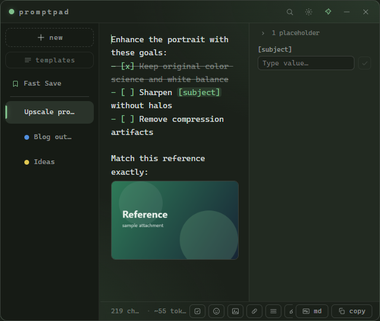
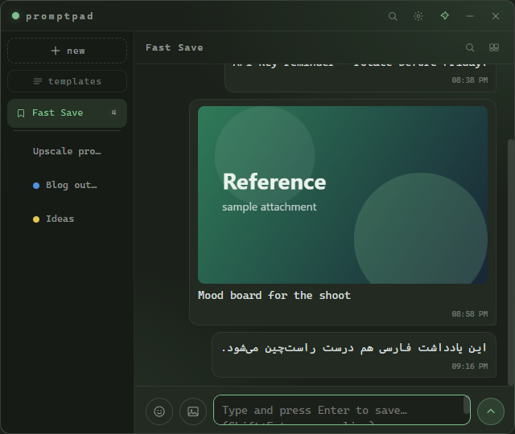
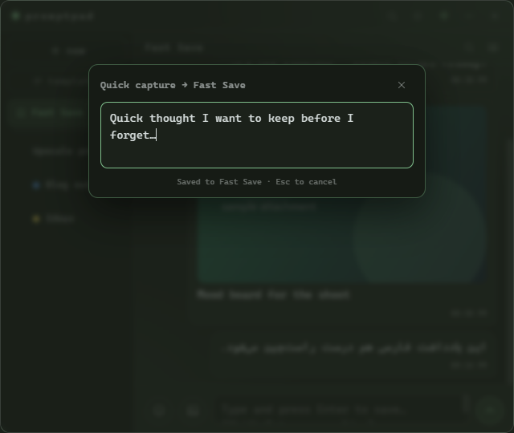
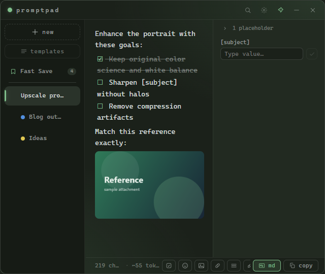
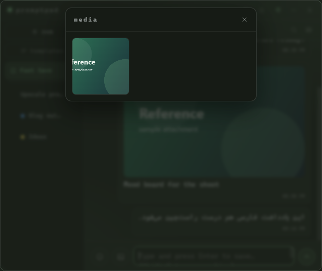
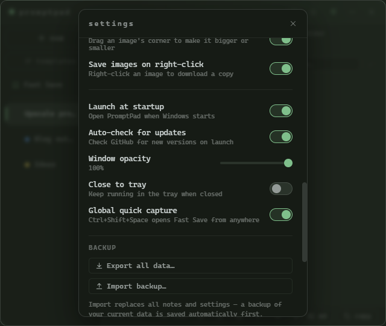
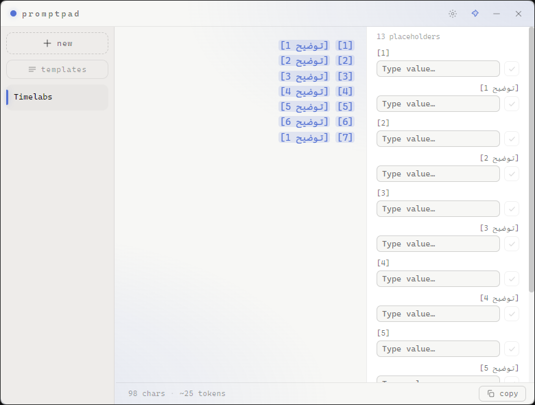
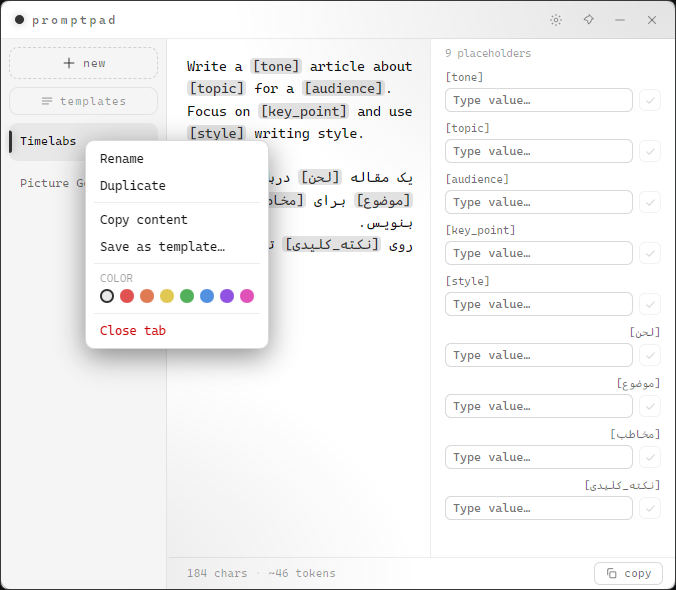
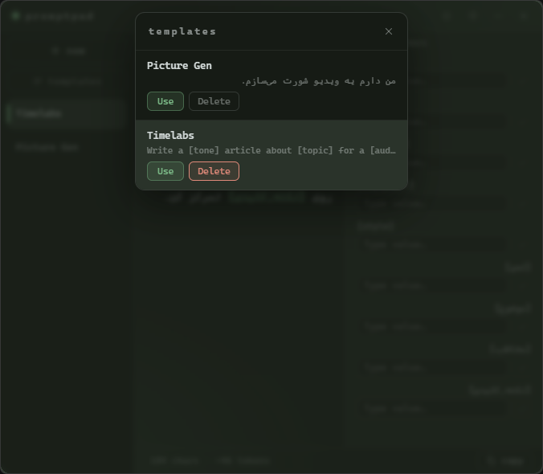

# PromptPad

A compact, always-on-top desktop notepad for writing and organizing AI prompts. Built with Electron.

Minimal, fast, and right next to your work — with tabs, 14 themes, live placeholder fill, templates, find & replace, a Telegram-style Fast Save, inline images, todo checklists, and a global quick-capture hotkey.

## ✨ New in 2.0

| Images & todo checklists | Fast Save (Telegram-style) | Quick capture |
|:---:|:---:|:---:|
|  |  |  |

| Markdown preview | Media gallery | Settings |
|:---:|:---:|:---:|
|  |  |  |

## 📸 Screenshots

| Dark theme + Placeholders | Light theme |
|:---:|:---:|
|  |  |

| Settings (Dark / Light) | Right-click context menu | Templates |
|:---:|:---:|:---:|
|  |  |  |

## ✨ Features

- **Compact always-on-top widget** — frameless window that floats above other apps, with a pin toggle
- **Tabs** — left sidebar or browser-style top layout
  - Add with `+`, click to switch, drag & drop to reorder
  - **Pin** tabs so they stay on top of the list
  - Auto-named from first line, double-click to rename
  - **Right-click context menu** — Rename, Duplicate, Copy content, Save as template, color (8 colors), Pin/Unpin, Close
- **14 themes** — 7 dark (Forest, Midnight, Carbon, Plum, Ember, Dracula, Mono) + 7 light (Paper, Sky, Sage, Rose, Latte, Lavender, Snow), grouped in Settings
- **Placeholder quick-fill** — write `[bracket]` or `{brace}` blanks; they highlight automatically and a fill bar lets you type values one by one
  - **Live preview** — typed value appears inside the prompt in real-time before you confirm
  - Enter jumps to the next field
  - Bar can sit above the prompt or as a resizable side panel; one scrollable line or stacked rows
- **Fast Save** — a chat-style "saved messages" note pinned above your tabs (like Telegram). Type and press Enter to save; each message keeps a timestamp with copy / **edit** / delete buttons and per-message RTL. Attach images (paste or button) with an optional caption, search your messages, and browse them all in a **media gallery** (right-click an image → **Go to message**). Toggle it off in Settings.
- **Quick capture** — press `Ctrl+Shift+Space` anywhere (even when the window is hidden) to pop a floating box; type or paste and hit Enter to drop it straight into Fast Save. Toggle in Settings.
- **Images** — paste (`Ctrl+V`), the image button, or drag & drop a file into a note. Thumbnails render inline; **drag a corner to resize**, **right-click to save a copy**, click to zoom. Both resize and right-click-save are toggleable in Settings → Images.
- **Todo checklists** — the checkbox button or type `- [ ] `; select several lines to turn them all into todos at once; click a checkbox to toggle done. Renders in the editor and the markdown preview.
- **Formatting toolbar** — `Ctrl+B` bold, `Ctrl+K` (or the link button) to insert a hyperlink, an **emoji picker**, a **justify** toggle, and a **clean-up** button that tidies extra spaces and blank lines. Links open in your browser from the markdown preview.
- **Markdown preview** — `Ctrl+M` or the `md` button; supports headings, lists, code, quotes, images, todos, and clickable links.
- **Find & Replace** — the title-bar search button or `Ctrl+F` to search with highlighted matches and match counter; `Ctrl+H` to replace one or all; an "all tabs" toggle also searches Fast Save
- **Backup** — export/import all your data as a single JSON file in Settings → Backup (a safety backup is written before every import). Export any single note to `.md`/`.txt` from its right-click menu.
- **Drag & drop** — drop `.txt`/`.md` files onto the window to create tabs; drop images to insert them into the current note.
- **Templates** — save any tab as a reusable template; open the Templates panel from the sidebar to browse, use, or delete
- **Smart RTL** — Persian/Arabic text aligns right automatically, per-tab; force with `Ctrl + Right Shift` / `Ctrl + Left Shift`
- **Undo / redo** (`Ctrl+Z` / `Ctrl+Y`) — per-tab history with coalesced typing
- **Auto-check for updates** — checks GitHub for new releases on startup; shows a dismissable banner if a newer version is available (toggle in Settings)
- **Char & token counter** + one-click copy
- **Autosave** — tabs, content, window position all persist
- **Launch at startup** (Windows)

## ⌨️ Shortcuts

| Shortcut | Action |
|----------|--------|
| `Ctrl+T` | New tab |
| `Ctrl+W` | Close tab |
| `Ctrl+Tab` / `Ctrl+PageDown` | Next tab |
| `Ctrl+PageUp` | Previous tab |
| `Ctrl+Shift+C` | Copy prompt |
| `Ctrl+F` | Find |
| `Ctrl+H` | Find & Replace |
| `Ctrl+B` | Bold selection |
| `Ctrl+K` | Insert link |
| `Ctrl+M` | Toggle markdown preview |
| `Ctrl+Z` | Undo |
| `Ctrl+Shift+Z` / `Ctrl+Y` | Redo |
| `Ctrl+Shift+Space` | Quick capture → Fast Save (global) |
| `Ctrl + Right Shift` | Force RTL (this tab) |
| `Ctrl + Left Shift` | Force LTR (this tab) |
| `Esc` | Close panel / find bar / overlay |

> Shortcuts use physical key positions so they work on Persian and other keyboard layouts.

## 🛠️ Development

```bash
npm install      # install dependencies
npm start        # run in dev mode
npm run dist     # build Windows installer → release/PromptPad Setup <version>.exe
```

## 👤 Author

- GitHub: [@raminturne](https://github.com/raminturne)
- Telegram: [t.me/fast_amozesh](https://t.me/fast_amozesh)

## 📄 License

MIT
