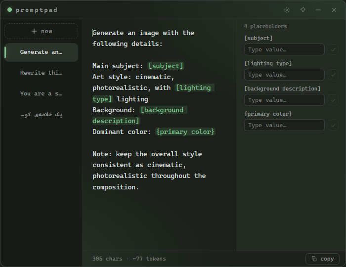
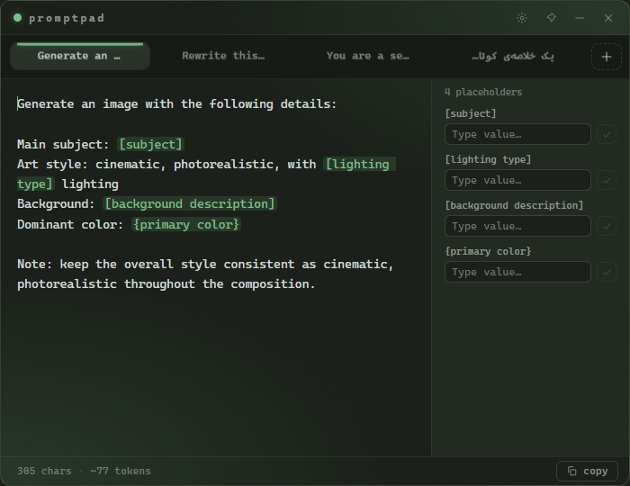
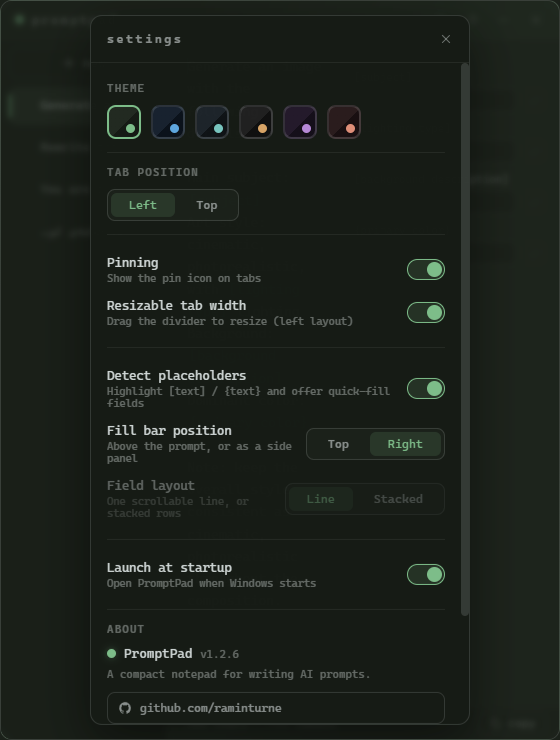
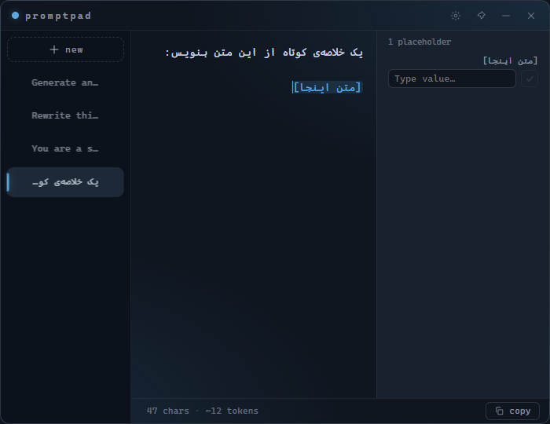
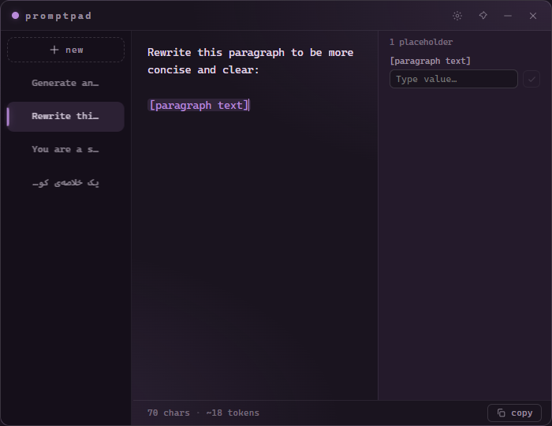

# PromptPad

A compact, always-on-top desktop notepad widget for writing and organizing AI prompts. Built with Electron.

Minimal, fast, and right next to your work — a quiet terminal-inspired pad with tabs, themes, and autosave.

## 📸 Screenshots

| Default | Top tabs (browser-style) |
|:---:|:---:|
|  |  |

| Settings | Midnight theme (RTL) | Plum theme |
|:---:|:---:|:---:|
|  |  |  |

## ✨ Features

- **Compact always-on-top widget** — frameless window that floats above other apps, with a pin toggle
- **Tabs** — left sidebar (vertical) or browser-style top layout
  - Add with `+`, click to switch
  - **Drag & drop** to reorder / categorize
  - **Pin** tabs (pinned ones stay on top)
  - Auto-named from the first line, double-click to rename
- **6 color themes** — Forest, Midnight, Slate, Carbon, Plum, Ember
- **Char & token counter** — handy for prompt writing
- **Copy** the whole prompt with one click
- **Smart RTL** — any Persian/Arabic in the text aligns it right (even if it starts with English); pure-English stays left. Direction is **per tab**, and you can force it with `Ctrl + Right Shift` (RTL) / `Ctrl + Left Shift` (LTR)
- **Autosave** to disk — tabs, content, window size & position persist
- **Settings panel** — themes, tab position, resizable tab width, pinning on/off, launch at startup, reset
- **Launch at startup** (Windows)

## ⌨️ Shortcuts

| Shortcut | Action |
|----------|--------|
| `Ctrl+T` | New prompt |
| `Ctrl+W` | Close tab |
| `Ctrl+Tab` / `Ctrl+PageDown` | Next tab |
| `Ctrl+PageUp` | Previous tab |
| `Ctrl+Shift+C` | Copy prompt |
| `Ctrl + Right Shift` | Force RTL (this tab) |
| `Ctrl + Left Shift` | Force LTR (this tab) |
| `Esc` | Close settings |

> Shortcuts use the physical key position, so they work on Persian (and other) keyboard layouts.

## 🎨 Default colors

- Background: `#1B211A`
- Text: `#D3DAD9`

## 🛠️ Development

```bash
npm install      # install dependencies
npm start        # run the app
npm run dist     # build the Windows installer (.exe) into release/
```

> The custom app icon is generated with `node build/make-icon.js`.

## 📦 Build output

`npm run dist` produces an NSIS installer at `release/PromptPad Setup <version>.exe`.

## 👤 Author

- GitHub: [@raminturne](https://github.com/raminturne)
- Telegram: [t.me/fast_amozesh](https://t.me/fast_amozesh)

## 📄 License

MIT
